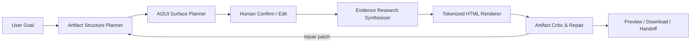

# AI2UI Generative Skills Spec

## 目标

AI2UI Skills 不是为单个 demo、测试脚本或某个业务页面服务的隐藏 prompt，而是一组可组合、可迁移的 Agent 能力模块。它们应该能同时服务公文写作、PPT 画布、合同审核、创意白板、报告生成、数智员工任务执行等场景。

核心原则：

- 能力优先，而不是场景优先：Skill 名称和职责围绕“规划、研究、渲染、审阅”等能力，不围绕“PPT、公文、合同”命名。
- Schema 优先，而不是文本优先：输出必须可被前端 renderer、状态机、审阅区或后续 Agent 消费。
- 上下文优先，而不是关键词规则：Skill 根据任务、受众、当前草稿、已有资料和目标状态判断，不靠固定关键词硬分类。
- 可回写优先，而不是一次性答案：每个 Skill 都应输出 patch、缺口、证据、状态或下一步动作。
- 可降级优先，而不是强依赖某个工具：WebSearch、文件检索、知识库、Hermes 工具都是来源，Skill 协议不绑定某个实现。

## 通用 Skill 分层

### 1. AI2UI Surface Planner

职责：把 Agent 的下一步动作转换成 UI patch。

适用：

- 缺字段时生成表单。
- 有多个方向时生成选择卡。
- 初稿完成后生成审阅区。
- 任务执行中生成进度、状态、操作按钮。
- 画布中生成节点或边。

不做：

- 不直接生成最终稿。
- 不把某个业务规则写死进组件。
- 不输出“建议你可以做一个表单”这类不可执行文本。

### 2. Evidence Research Synthesizer

职责：把资料缺口转成研究任务，并把 WebSearch、文件、知识库结果归纳成证据包和内容 patch。

适用：

- “缺资料 / 联网补充”按钮。
- 报告、PPT、文章、公文、合同条款的事实支撑。
- 企业知识库或上传文件的引用归纳。

不做：

- 不编造数字、政策、案例。
- 不把用户原话直接当搜索词。
- 不把搜索摘要原样塞回 UI。

### 3. Artifact Structure Planner

职责：为任意交付物生成可编辑结构。

适用：

- deck：章节、页面、每页主张、资料依赖。
- document：标题、正文结构、字段依赖、格式要求。
- report/article：段落结构、证据位置、图表需求。
- workflow/review_package：步骤、状态、审阅清单。

不做：

- 不直接生成 HTML、DOCX、PPT。
- 不把“至少几页”这类 demo 约束硬编码到 Skill 内。

### 4. Tokenized HTML Renderer

职责：把结构化 artifact spec 和设计 Token 渲染成安全、可预览、可下载 HTML。

适用：

- HTML PPT。
- 在线报告。
- 审阅页。
- 长文预览。
- 看板式交付物。

不做：

- 不重新规划内容。
- 不发明品牌色和字体。
- 不依赖远程脚本才能预览。

### 5. Artifact Critic & Repair

职责：审阅结构、内容、证据、布局、可访问性和状态流转，并输出可执行 repair patch。

适用：

- 生成后质量门禁。
- 发布前检查。
- 前端预览不理想时自动修复。
- Hermes 生成 JSON 不稳定时的结构修复。

不做：

- 不泛泛评价。
- 不大范围重写用户已经确认的内容。
- 不在关键问题未解决时标记 ready_to_publish。

## 推荐流水线

## 反模式

- 只为了某个页面测试，把 Skill 写成固定关键词规则。
- 输出自然语言建议，但没有 schema、patch、action 或 state。
- 把 WebSearch 摘要当成最终证据，不做可信度和适用位置判断。
- HTML renderer 重新创作内容，导致用户确认过的大纲被改写。
- Critic 只打分不给 repair patch。
- 所有场景共用一个大 prompt，导致职责混乱、难以调优。

## 当前落地位置

- 租户级种子 Skill：`backend/app/db/session.py`
- PPT 画布 Prompt 与研究链路：`backend/app/main.py`
- 前端上下文按钮与 HTML renderer：`frontend/src/pages/PresentationCanvas.tsx`

后续如果要进入 Hermes 原生 Skill 包，可以按同一协议导出为 `SKILL.md + references/schema.json + examples/*.json` 的 ZIP 包。
